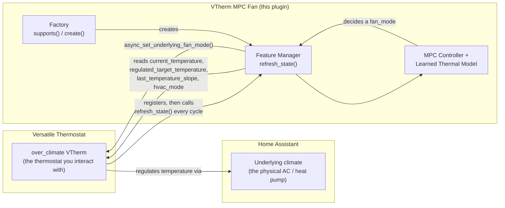
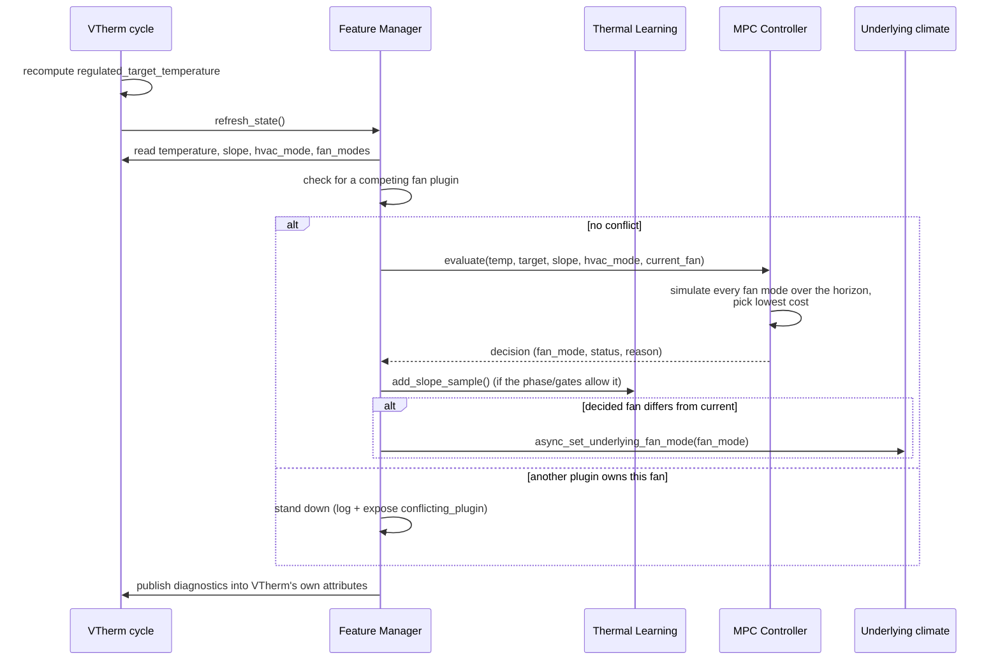

# VTherm MPC Fan

[](https://github.com/hacs/integration)

A Model Predictive Control (MPC) fan-speed controller for [Versatile Thermostat](https://github.com/jmcollin78/versatile_thermostat), delivered as a VTherm **Feature Manager plugin** rather than a standalone integration. It attaches to an `over_climate` VTherm, learns the thermal response of each fan speed on the underlying climate device, and drives that fan to minimize a predictive comfort/energy cost — instead of the fixed threshold rules VTherm's built-in auto-fan uses.

---

## Table of Contents

- [VTherm MPC Fan](#vtherm-mpc-fan)
  - [Table of Contents](#table-of-contents)
  - [How this fits into VTherm](#how-this-fits-into-vtherm)
  - [Installation](#installation)
    - [HACS (Recommended)](#hacs-recommended)
    - [Manual Installation](#manual-installation)
  - [Requirements](#requirements)
    - [Version policy](#version-policy)
  - [Quick Setup](#quick-setup)
  - [Configuration Parameters](#configuration-parameters)
  - [One control cycle](#one-control-cycle)
  - [MPC Controller](#mpc-controller)
    - [Which setpoint](#which-setpoint)
    - [Setpoint drop and overshoot](#setpoint-drop-and-overshoot)
    - [Cost Function](#cost-function)
    - [Hysteresis and Guards](#hysteresis-and-guards)
    - [Phase Detection](#phase-detection)
    - [Disturbance Handling](#disturbance-handling)
    - [Defrost Detection](#defrost-detection)
    - [HVAC Idle Detection](#hvac-idle-detection)
    - [Window-Open Detection](#window-open-detection)
    - [HVAC Modes](#hvac-modes)
    - [Fan Speed Order](#fan-speed-order)
  - [Learning System](#learning-system)
    - [Per-Mode Fan Profiles](#per-mode-fan-profiles)
    - [Dead Time Calibration](#dead-time-calibration)
    - [Duplicate-Reading Filtering](#duplicate-reading-filtering)
    - [Defrost / Idle / Window Learning Exclusion](#defrost--idle--window-learning-exclusion)
  - [Sensors \& Entities](#sensors--entities)
    - [MPC Sensors](#mpc-sensors)
    - [The `mpc_fan` attribute of the VTherm](#the-mpc_fan-attribute-of-the-vtherm)
    - [Learning Sensors](#learning-sensors)
    - [Learning Profile Numbers](#learning-profile-numbers)
  - [Services](#services)
    - [`vtherm_mpc_fan.reset_learning`](#vtherm_mpc_fanreset_learning)
    - [`vtherm_mpc_fan.set_effective_slope`](#vtherm_mpc_fanset_effective_slope)
    - [`vtherm_mpc_fan.force_fan`](#vtherm_mpc_fanforce_fan)
  - [Coexisting with other fan plugins](#coexisting-with-other-fan-plugins)
  - [Troubleshooting](#troubleshooting)
  - [License](#license)

---

## How this fits into VTherm

VTherm exposes an extension point — the [Feature Manager API](https://github.com/jmcollin78/versatile_thermostat) (`vtherm_api`) — that lets an external plugin attach to one specific `over_climate` thermostat and be called once per control cycle. This project is one such plugin: it registers a factory that VTherm asks *"do you apply to this thermostat?"*, and once accepted, VTherm hands it a live runtime view (current temperature, regulated setpoint, learned slope, HVAC mode, the underlying's fan modes, a way to set them) at the end of every cycle.



Two consequences follow directly from this design:

- **No separate device to configure.** You never point this plugin at a climate entity directly — you point it at the *VTherm*, and it reads/drives the underlying through VTherm's own runtime.
- **One cadence.** The control cycle is VTherm's `cycle_min` (5 minutes by default), not a private timer. See [One control cycle](#one-control-cycle).

---

## Installation

### HACS (Recommended)

1. Open HACS in Home Assistant
2. Go to **Integrations**
3. Click the three-dot menu → **Custom repositories**
4. Add `https://github.com/Gamso/vtherm_mpc_fan` with category **Integration**
5. Search for **VTherm MPC Fan** and install it
6. Restart Home Assistant

Alternatively, click the button below to open this repository directly in HACS:

[](https://my.home-assistant.io/redirect/hacs_repository/?owner=Gamso&repository=vtherm_mpc_fan&category=integration)

### Manual Installation

1. Copy the `custom_components/vtherm_mpc_fan` directory to your Home Assistant `custom_components` folder
2. Restart Home Assistant
3. Add the integration via the UI (Settings → Devices & Services → Add Integration)

---

## Requirements

- **Versatile Thermostat ≥ 10.2.0**, which provides `vtherm_api` ≥ 0.4.0 (the plugin API this project registers with) — see [Version policy](#version-policy)
- An **`over_climate` VTherm already configured** in VTherm, on top of a climate entity that exposes **two or more manual fan speeds** (e.g. `low`, `medium`, `high`)
- VTherm's own auto-fan left **off** (*Auto fan mode* = `None`) on that VTherm — the plugin stands down while it is on, see [Coexisting with other fan plugins](#coexisting-with-other-fan-plugins)

### Version policy

- The plugin only uses the `vtherm_api` surface of **0.4.0** (the feature-manager factory registry, `regulated_target_temperature`, the underlying fan modes, `get_vtherm_logger` / `write_event_log`); nothing from 0.5.0 is required. 0.4.0 shipped with Versatile Thermostat 10.2.0, hence that floor.
- `vtherm_api` is **not** declared in `manifest.json`: it is installed by Versatile Thermostat (10.2–10.4 require `>=0.4.0`, 10.5 `>=0.5.0`), which is also what the official `vtherm_auto_fan_extended` plugin does. Declaring it would make Home Assistant install the API without the thermostat, and the plugin would then load but never be called — instead of reporting that Versatile Thermostat is missing.
- The tests declare `vtherm_api>=0.4.0,<1.0`, and CI runs them against both the floor (0.4.0) and the latest release, including a check of the plugin's classes against the API's runtime-checkable Protocols.
- Set the VTherm's *Auto fan mode* to `None`: VTherm's built-in auto-fan is a competing controller (see [Coexisting with other fan plugins](#coexisting-with-other-fan-plugins)).

---

## Quick Setup

1. Configure the VTherm first (Settings → Devices & Services → Add Integration → Versatile Thermostat → `over_climate`, pointed at your fan-capable climate entity)
2. **Settings → Devices & Services → Add Integration → VTherm MPC Fan**
3. Select the VTherm you just created
4. Configure parameters (or use the defaults) — save, and the controller starts on the next VTherm cycle
5. Optionally, open **Configure** again once the fan modes are known to set the [fan speed order](#fan-speed-order)

---

## Configuration Parameters

All parameters can be changed at any time via **Settings → Devices & Services → VTherm MPC Fan → Configure**.

| Parameter             | Default  | Range           | Description                                                                                                                                                             |
| ---------------------- | -------- | ---------------- | ------------------------------------------------------------------------------------------------------------------------------------------------------------------------ |
| **Deadband**           | `0.2°C`  | `0.0` – `5.0°C` | Comfort zone around the user's setpoint: a predicted error inside it costs nothing, on either side, so only energy decides there. Increase to reduce fan changes.                                                                         |
| **Min Interval**       | `10 min` | `1` – `60 min`  | Minimum time between non-emergency fan changes. Prevents rapid oscillations.                                                                                             |
| **Data Collection**    | `true`   | —                | Records one CSV row per control cycle in the HA config folder (`vtherm_mpc_fan_data_XXXXXXXX.csv`, max 10 MB, auto-rotated). Useful for offline analysis.               |
| **Defrost Entity**     | *(none)* | —                | Optional entity (`binary_sensor`, `sensor`, or `input_boolean`) that reports when the heat pump is in a defrost cycle. VTherm does not report this itself. See [Defrost Detection](#defrost-detection). |
| **Fan Speed Order**    | detected | —                | One dropdown per fan speed rank, only shown once the underlying's fan modes are known (options-flow only). See [Fan Speed Order](#fan-speed-order).                     |
| **HVAC modes with a fixed fan speed** | *(none)* | modes the VTherm reports except `off`, `heat`, `cool` | In these modes the fan is pinned to the **Fixed fan speed** — e.g. `dry` and `fan_only` at `superhigh` (options-flow only). See [HVAC Modes](#hvac-modes). |
| **Fixed fan speed**    | *(none)* | fan modes the underlying reports | The speed used in the fixed-speed modes. Required as soon as one fixed-speed mode is selected (options-flow only).                                    |
| **Exploration probe**  | `true`   | —                | Lets the controller try, now and then, a weaker speed that has never been measured while the room holds — see [Hysteresis and Guards](#hysteresis-and-guards). |
| **Exploration bonus**  | `false`  | —                | Advanced. Near the setpoint, favours poorly measured speeds in the cost. |
| **Measure intermediate speeds under load** | `false` | — | Advanced. On a climb outside a recovery, stops first on the lowest unmeasured speed predicted to make progress. |
| **Thompson sampling**  | `false`  | —                | Advanced. Draws each learned speed's slope from its uncertainty every cycle — see [Per-Mode Fan Profiles](#per-mode-fan-profiles). |

There is no "operating entity" or "outdoor temperature" option to set: whether the unit is producing is read from the underlying climate's own `hvac_action`, and the outdoor temperature from the VTherm runtime (`current_outdoor_temperature`) — see [HVAC Idle Detection](#hvac-idle-detection).

---

## One control cycle



The MPC's internal prediction step (2 minutes) is independent of how often this cycle actually runs — VTherm's `cycle_min` can be 2, 5, or 15 minutes without changing the granularity of the simulated trajectory. Measurements on a 15-day production trace showed VTherm typically doesn't recompute its temperature slope faster than every few minutes anyway (it only recomputes on a new sensor reading), so a duplicate reading is filtered before it reaches the learning model — see [Duplicate-Reading Filtering](#duplicate-reading-filtering).

---

## MPC Controller

The MPC (Model Predictive Control) engine is the sole decision-maker for fan speed. Each cycle, it evaluates every available fan mode by simulating temperature evolution over an adaptive horizon and selecting the mode with the lowest cost.

To eliminate "dead-time blindness" during startup or large setpoint changes when the physical system has lag, the simulation horizon resolves adaptively to:

```
horizon = dead_time + 60 minutes
```

This ensures that every candidate fan speed is simulated for a full hour of active response after its transition delay. During the first `dead_time` minutes every candidate — the current speed included — follows the slope the room is showing, so staying and switching are compared on the same basis. Sixty minutes rather than thirty: on a 30-minute window the cheap speed that drifts out of the band only after half an hour always beat the one that holds the band, and the controller alternated a weak and a strong speed around the one that would have held.

See [docs/mpc_mode.md](docs/mpc_mode.md) for the full technical design.

### Which setpoint

VTherm's auto-regulation shifts the user's setpoint (`target_temperature`) into a *regulated* one (`regulated_target_temperature`), the value actually sent to the unit. The MPC judges comfort — its cost, the deadband, the escalation and learning holds, the setpoint drop — against **the user's setpoint**: the regulated one drifts with the regulation (on the production trace it sat 0.6 °C below the user's in median while the strongest speed ran), and regulating the fan on it chased that drift. The difference, `regulation_offset` (regulated − user), is kept as a measurement: it is stored with every learning sample and may enter the learned model (see [Per-Mode Fan Profiles](#per-mode-fan-profiles)).

### Setpoint drop and overshoot

- **Setpoint drop**: the user moved the setpoint away by at least 1 °C between two cycles (lower in heat, higher in cool) and the room is now more than 1 °C past it. The MPC goes straight to the lowest speed, and slope learning pauses for 30 minutes. The status lasts until the room is back within 1 °C, or the setpoint is raised again.
- **Overshoot**: the room is more than 1 °C past the setpoint *without* any setpoint change. The MPC selects the lowest speed the guards allow (min interval, step-down guard), and learning goes on — nothing about the room's response is abnormal.

### Cost Function

Each candidate fan mode is scored with:

| Component                   | Purpose                                                                      |
| --------------------------- | ----------------------------------------------------------------------------- |
| **Comfort error × urgency** | Penalizes being outside the deadband (either side), with dynamic step-by-step urgency |
| **Overshoot²**               | Penalizes going past the target temperature                                   |
| **Floor violation**         | Penalizes a predicted *shortfall* beyond the deadband — below the setpoint in heat, above it in cool (linear + quadratic) |
| **Mode-change cost**        | Penalizes unnecessary fan jumps (proportional to step distance)              |
| **Mode-rank cost**          | Energy: `1.0 × 1.82^rank`, so one more rank costs what ~0.05–0.13 °C of sustained shortfall costs |

The thermal terms are averaged over the simulation steps, so costs read "per step" whatever the horizon, and inside the deadband they are zero: there the cheapest speed that keeps the predicted room inside the band wins. A sustained shortfall of `x` °C beyond the deadband costs `13x + 56x²` per step. The minimum interval is a gate, not a cost.

### Hysteresis and Guards

- **Hysteresis**: a recommendation that changes the fan must beat the current mode by a minimum cost margin. The margin is larger when near the target (0.5) and smaller when far away (0.2), plus 0.2 outside the established phase, 0.1 per rank, and 0.4 + 1.0 per °C of error for a step down while under target.
- **Step-down hold**: blocks a jump of more than one rank down to a fan mode whose own learned profile cannot sustain progress at the current comfort error — this is what stops the controller diving straight to a speed with no track record of actually holding the room.
- **Min interval**: non-emergency changes respect the configured minimum interval between fan changes.
- **Learning hold**: while the *current* speed has no measured profile (seeded values do not count), the dwell is raised to the learning gate (1.5× dead time) plus 10 minutes so the speed can actually be sampled before it is left. A speed that is never measured is never credible on cost and never chosen again, which is how intermediate speeds stayed unknown. The hold yields to comfort: it is released by the escalation guard, by an overshoot that keeps worsening, and it never applies more than 1 °C from target.
- **Climb guard**: rising more than one rank may not skip over an intermediate speed that has no measured profile and looks viable — that rung is tried first, because a speed can only be measured under load and load is exactly what a rising error means. Recoveries stay direct: past 1 °C of error (a setpoint step) or when the escalation guard fires, the jump goes straight to the strongest speed.
- **Exploration probe** (option, on by default): a cost driven by estimates seldom chooses a speed nobody measured. While the room holds inside the deadband in an established regime, with a disturbance bias under 0.1 °C/h, the controller steps **one rank down** to a weaker speed that has no measured profile and was not probed in the last 6 hours (`mpc_reason` reads `Exploration probe`). The learning hold then keeps it long enough to be measured — near equilibrium, where it would serve. The probe is abandoned, and the climb back allowed at once, as soon as the comfort error exceeds the deadband plus one sensor step. Probe times are stored with the learning data; `mpc_exploration_probes` counts them.
- **Exploration bonus** (option, off): inside the deadband each candidate's cost is lowered by `1.0 / √(1 + n)`, `n` its measured regime in 10-minute intervals, so a poorly measured speed wins when the predicted trajectories are close.
- **Measurement under load** (option, off): when a climb is decided outside a recovery, the controller stops first on the lowest unmeasured speed predicted to make progress (its slope at the current error plus the disturbance bias is positive). It lengthens the climb by about a dead time; it is the only way to measure how a speed's output grows with the error.

### Phase Detection

After each fan speed change, the controller classifies elapsed time into three phases:

| Phase           | Condition                              | Meaning                            |
| --------------- | --------------------------------------- | ------------------------------------ |
| **DEAD_TIME**   | `elapsed < dead_time`                   | Sensor hasn't reacted yet            |
| **TRANSIENT**   | `dead_time ≤ elapsed < dead_time × 1.5` | Sensor starting to respond          |
| **ESTABLISHED** | `elapsed ≥ dead_time × 1.5`             | Slope reflects the current fan regime |

The default dead time is 10 minutes, replaced by the learned median response time of the current HVAC mode as soon as response events exist (heating lag and cooling lag are learned separately; a mode with no event yet borrows the other's), capped at 15 minutes for these phases. The controller and the learner share this one clock: a slope sample is never taken while the MPC still considers the room in its dead time or transient.

An escalation guard sits on top of this lock: if the comfort error keeps worsening since the last fan change, an *escalation only* (never a step-down) is allowed to bypass the phase lock, even mid dead-time — this is what protects against getting stuck above setpoint with no way out if an earlier decision turns out to be too weak. The growth must exceed `max(0.15, 1.5 × sensor resolution)` — 0.30 °C for a 0.2 °C sensor — on **two consecutive cycles**; only past 1 °C of comfort error does it escalate at once. The sensor resolution is detected automatically (smallest non-zero change between two readings over the last day, bounded to 0.05–0.5 °C, 0.2 until known) and published as `mpc_sensor_resolution`. With a fixed 0.15 °C threshold a single 0.2 °C sensor step escalated, bypassing the min interval, the hysteresis, the climb guard and the learning hold.

### Disturbance Handling

The MPC tracks a **disturbance bias** — an EMA estimate of unmodeled thermal effects (solar gains, occupancy). This correction is added to learned slopes during simulation. The bias only updates during the ESTABLISHED phase with a known profile, and decays during disturbed periods.

When a disturbance is detected (window open, defrost, or HVAC idle), the MPC pauses and returns `Disturbed` status — the current fan mode is held.

### Defrost Detection

When a heat pump defrosts its outdoor coil, the heat output drops sharply. Without defrost awareness, the controller would misinterpret the falling slope.

**Underlying `hvac_action` (no configuration)**: when the underlying climate itself reports `hvac_action: defrosting`, defrost protection activates.

**External entity (fallback)**: for units that report nothing, configure a `binary_sensor`, `sensor`, or `input_boolean` that reports defrost state — VTherm does not expose this itself. When the entity is `on`/`true`/`1`, defrost protection activates.

Either way, protection is held for a 20-minute cooldown after the signal clears.

**During defrost protection**: the MPC pauses (`Disturbed`), and learning samples are excluded.

### HVAC Idle Detection

When the heat pump compressor is off (setpoint reached, system coasting), the HVAC is not actively heating or cooling — changing fan speed at that moment would be a wasted, meaningless command.

This is read from the underlying climate's own `hvac_action` (`idle` or `off`, or the climate itself being `off`) — **no configuration needed**, and it cannot be disabled. VTherm's `is_device_active` is deliberately *not* used: when the underlying publishes no `hvac_action`, VTherm synthesises one from a target-vs-current sign check that reads idle across the whole "at or past setpoint" region — exactly the equilibrium this controller holds, while the unit is usually still running. A climate that publishes no `hvac_action` is therefore treated as unknown (not idle), and control continues.

**During HVAC idle**: the MPC pauses (`Disturbed`), and learning samples are excluded.

### Window-Open Detection

Also read straight from VTherm: when VTherm itself has stopped the underlying because a window is open (`hvac_off_reason == "hvac_off_window_detection"`), the MPC pauses (`Disturbed`) and learning is excluded — no separate configuration.

### HVAC Modes

The MPC regulates the fan only in `heat` and `cool` (not configurable): they are the only modes with a defined comfort direction and learned profiles. In every other mode (`off`, `dry`, `fan_only`, `heat_cool`, `auto`…) it is paused (`Idle`) and the fan is left untouched — unless that mode has a fixed fan speed.

**Fixed fan speed per HVAC mode.** Pick the modes (for instance `dry` and `fan_only`) and the speed (for instance `superhigh`) in the options flow; only modes the VTherm reports are offered, and the two fields only appear once a speed is selectable (or one is already stored). When the thermostat enters one of those modes the speed is applied on the next control cycle. While it stays in the mode the plugin re-applies the speed only once **Min Interval** has elapsed since the last fan change, so a manual speed change is respected for that long before being reverted. After a Home Assistant restart, a VTherm reload or an options change, the plugin has no change history: the speed is then re-applied only once **Min Interval** has elapsed since the plugin's first cycle, so a manual speed is not overwritten at startup. Nothing is sent while a window is open, the underlying is off or defrost is active (some IR/cloud units treat any fan command as power-on); the pin resumes once that clears.

The pin is a plain command, not regulation: the speed's slope is not learned and no dead-time (response) event is recorded outside `heat`/`cool`. In the VTherm's [`mpc_fan` attribute](#the-mpc_fan-attribute-of-the-vtherm), `mpc_status` reports `Fixed` and `mpc_reason` names the mode (and why the speed is held, if it is). A `force_fan` override takes precedence over the pin.

### Fan Speed Order

The controller treats a fan mode's position in its list as its strength: it drives the energy-cost term, the step-down safety guard, and the fallback estimate used for a speed that has not been learned yet. By default this order is whatever the underlying climate reports, which is usually correct.

If a speed is in the wrong position, the options flow (available once the underlying's fan modes are known) shows one dropdown per rank — "rank 1" is the weakest — defaulting to the order currently in effect. Change the dropdown at the rank that's wrong; the field cannot be left half-set; picking the same speed at two ranks is rejected.

---

## Learning System

The plugin includes an **automatic learning system** that builds the thermal model during normal operation. `learning_progress` reaches 100 % at 120 slope samples (sized to what the 7-day window can hold); it is an overall progress indicator only — each speed's profile and the dead time become usable on their own, much earlier.

**Data collected, once per control cycle**:
- Temperature slope, comfort error, regulation offset and active fan mode
- Time from a fan speed change to the room's first move in the expected direction (thermal response time)
- HVAC mode (heat/cool), for per-mode profiling

> **Note**: the `effective_timeout` diagnostic (`max(min_interval, dead_time × 1.5)` once the dead time is trusted — see [Dead Time Calibration](#dead-time-calibration)) is exposed as a sensor for insight into the learned thermal lag, but it does not gate control decisions — the minimum interval between fan changes does.

`reset_learning` starts over. The deadband and the minimum interval are options you set; nothing learned overrides them.

### Per-Mode Fan Profiles

The learning system tracks the **effective slope per fan mode and HVAC mode** (e.g. "medium in heat" vs "high in cool"). This provides visibility into which fan speeds are actually effective in each mode.

A profile is **measured** once its measured samples (as opposed to the synthetic ones written when you set a value by hand) cover **90 minutes of established regime**, in at least 6 samples; only then does the MPC treat the speed as known rather than guessed — see the `measured_minutes`, `real_samples` and `value_source` attributes below. A sample is taken at most once per **10 minutes** of established regime, and at least that often even when the slope has not moved: a speed that holds the room still keeps the sensor silent, and requiring a new sensor reading per sample starved precisely the speeds that work (on the production trace, after the established gate only the strongest speed ever reached ten distinct readings in one hold). Each sample records the minutes it stands for. A hand-set profile is usable straight away, but stays *seeded* until measured. Each profile keeps its 40 newest samples however old they are, so a speed measured a few times a week accumulates across weeks instead of losing to the 7-day window what it gathered the week before.

Samples are filtered out when:
- A window is open, or the compressor is idle, or defrost is active (see the detection sections above)
- The user dropped the setpoint (status `Setpoint drop`, night mode) — including a **30-minute cooldown** after the drop. A room past an unchanged setpoint (`Overshoot`) is still learned
- The comfort error is below −1 °C
- The fan mode hasn't been active long enough (**1.5× dead time**, the `ESTABLISHED` phase) for the room's response to fully reflect the current mode
- The phase is not yet `ESTABLISHED`
- The reading duplicates the last one accepted for that fan mode — see [Duplicate-Reading Filtering](#duplicate-reading-filtering)

A near-zero slope is **not** filtered out: a speed that holds the room at the setpoint produces exactly that, and it is the measurement of the profile's intercept. (An earlier 0.15 °C/h stagnation cut censored the bottom of the distribution, which both over-estimated the weak speeds and starved the intermediate ones of the few samples they get.)

The effective slope is gap-dependent: each profile fits `slope(error) = a + b × error` over its measured samples with a **robust (Theil–Sen) estimator** — the weighted median of the pairwise slopes — so a few contaminated samples cannot drag the line; the gain `b` is clamped to be non-negative and shrunk toward the gain shared by all speeds (see [Duplicate-Reading Filtering](#duplicate-reading-filtering)). The reported value is that line evaluated at a representative comfort error of 1 °C — or at the largest error the speed was actually measured at, if smaller: the line is **never extrapolated**, and such a profile is reported as `partial`. Each profile also carries its uncertainty, `slope_sigma` (°C/h). The error is the comfort error against the user's setpoint. Samples recorded by earlier versions measured it against the regulated setpoint and cannot be corrected (the offset was not stored): they are kept, so an upgrade loses no profile, but weigh a quarter of a current sample and age out with the 7-day window and the per-profile retention (`legacy_samples` in the profile attributes). When the regulation offset varied enough over a profile's samples (standard deviation ≥ 0.1 °C beyond what the error explains, ≥ 10 samples), a second, shrunk term models it — the offset is a proxy for how hard the inverter compressor is driven. Profiles without enough measured samples carrying an error, or whose samples all sit at the same error, fall back to the **median** slope. While a hand-set profile has fewer than 10 measured samples, the seeded and measured medians are weighted by their counts, so every measurement visibly pulls the value instead of hiding behind the seeded one.

When two fan speeds' learned slopes are out of order (e.g. a rarely-used speed's small sample happens to read stronger than a well-sampled one above it), the ladder is corrected by an **isotonic regression** weighted by each profile's effective sample size: the two are pooled at their weighted mean, so a thin estimate barely moves a well-sampled one. Pooled speeds — or two learned at exactly the same slope — would then be thermally indistinguishable to the cost function, and the energy term would always pick the weaker one; the better-sampled one keeps the value and the other is placed one ladder step away from it.

**Cold start.** While no speed of the HVAC mode has any profile (neither measured nor set by hand), the controller does not compare guesses: it applies a step law on the comfort error — one rank per 0.3 °C beyond the deadband, never down while short of the setpoint, one rank down when past it — under the usual min interval and learning hold, and learns from the speeds it visits (`mpc_reason` reads `Cold start`).

**Thompson sampling** (option, off by default): each cycle every learned speed's representative slope is drawn from a normal law of its `slope_sigma` before the ladder is made monotone, so a poorly known speed is now and then credited with what it might do and gets tried.

### Dead Time Calibration

The system measures the **thermal response time** — the delay between a fan speed change and the first move of the room temperature, of at least one sensor step, **in the direction the change should produce** (cooler after a climb in cool, warmer after a climb in heat, the reverse after a step down). This median value replaces the default 10-minute dead time. It used to be detected on VTherm's slope, which fired on the very next sensor reading whatever its direction, so on a 0.2 °C sensor the "dead time" was mostly the wait for that reading (17.5–28.5 min).

Response events are only recorded in `heat` and `cool`, when the delay is between 2 and 60 minutes (filtering sensor noise and system-off periods), and **once per fan change**. A change made in one HVAC mode is never answered by a temperature move in another, and events stored from other modes are ignored.

The learned dead time sets the prediction horizon and the adaptive change interval. The learning gate, the phase split (`DEAD_TIME` / `TRANSIENT` / `ESTABLISHED`) and the learning hold use it **capped at 15 minutes**: with a coarse sensor a long learned value is mostly the sensor's wait, and gating on it held every unmeasured speed for ~50 minutes before its first sample.

The dead time is learned **per HVAC mode**. It raises the minimum interval between changes (up to 3× **Min Interval**) only once it is *trusted*: at least 5 response events in the current mode. Until then the configured **Min Interval** applies as is.

A fan change made outside the plugin — remote control, another automation — counts as a change too: the dead time, the response event and the learning gate all restart from it. To try a speed by hand and have it learned, prefer the `force_fan` service, which also holds it for the duration you choose.

### Duplicate-Reading Filtering

VTherm recomputes its temperature slope only when the room sensor reports a new value, so consecutive control cycles frequently observe the exact same number — especially at a short `cycle_min`. Within 10 minutes of the last sample accepted for a fan mode, a reading whose slope has not moved is dropped before it reaches the model. Past those 10 minutes the same reading is a new sample — the regime held for another interval — and the profile is credited with that much regime. Successive samples of one regime are strongly correlated, so the fit does not count them as independent: it estimates the lag-1 autocorrelation of its residuals (ρ) and works with an effective sample size `n_eff = n / (1 + 2ρ)`, exposed as `effective_samples`. The gain `b` of a profile is shrunk toward the gain pooled over all the speeds of the HVAC mode, as if 10 independent samples had shown the pooled value: `b = (n_eff·b_profile + 10·b_pooled) / (n_eff + 10)`.

### Defrost / Idle / Window Learning Exclusion

Slope samples and response-time events collected while defrost is active, the compressor is idle, or a window is open are never added to the learned profiles — see the corresponding detection sections above for why each one would otherwise bias the effective-slope and dead-time estimates.

---

## Sensors & Entities

Entity IDs are scoped by the VTherm you attached this plugin to (not the underlying climate). For example, a controller attached to `climate.living_room` (the VTherm entity) exposes `sensor.vtherm_mpc_fan_living_room_fan_mode`.

### MPC Sensors

| Entity                                                                | Unit  | Description                                                        |
| ----------------------------------------------------------------------- | ----- | --------------------------------------------------------------------- |
| `sensor.vtherm_mpc_fan_living_room_fan_mode`                            | —     | Fan mode in effect after this cycle (MPC, forced or fixed)           |
| `sensor.vtherm_mpc_fan_living_room_fan_mode_last_change`                | min   | Minutes since the last fan change (ours or external)                 |
| `sensor.vtherm_mpc_fan_living_room_mpc_confidence`                      | %     | Confidence derived from learned profile coverage                      |
| `sensor.vtherm_mpc_fan_living_room_mpc_predicted_temperature_10_min`    | °C    | Predicted temperature after 10 minutes with the recommended mode      |
| `sensor.vtherm_mpc_fan_living_room_mpc_predicted_temperature_30_min`    | °C    | Predicted temperature after 30 minutes with the recommended mode      |
| `sensor.vtherm_mpc_fan_living_room_mpc_disturbance_bias`                | °C/h  | Learned disturbance correction currently applied by the MPC model     |

### The `mpc_fan` attribute of the VTherm

Point-in-time values with no history or automation use are not separate entities: they live in the `mpc_fan` attribute section of the VTherm entity itself (and in a DEBUG log line on every cycle).

| Key                     | Description                                                                                       |
| ----------------------- | --------------------------------------------------------------------------------------------------- |
| `mpc_status`            | `Ready`, `Low confidence`, `Setpoint drop`, `Overshoot` (MPC steering); `Disturbed`, `Idle`, `Unavailable` (paused); `Fixed` (pinned speed), `Forced` (`force_fan`) |
| `mpc_reason`            | Explanation of the current decision                                                               |
| `mpc_fan_mode`          | Fan mode chosen (by the MPC, the pin or the override)                                             |
| `mpc_would_change_now`  | Whether the fan is being changed right now                                                        |
| `mpc_cost`, `mpc_confidence`, `mpc_predicted_temperature_10m`, `mpc_predicted_temperature_30m`, `mpc_dead_time`, `mpc_known_profiles`, `mpc_disturbance_bias` | Details of the last MPC evaluation |
| `mpc_comfort_error`, `mpc_regulation_offset` | Error against the user's setpoint (positive = needs more heating/cooling), and VTherm's regulated setpoint minus the user's |
| `mpc_sensor_resolution` | Room sensor resolution detected from the readings (°C) |
| `mpc_exploration_probes` | Exploration probes started so far (persisted) |
| `fan_mode_order`        | Fan speed ladder in use, weakest first                                                            |
| `sent_fan_mode`         | Last fan mode this plugin sent                                                                    |
| `learning_ready`        | Whether global learning readiness has been reached                                                |
| `forced_until`          | Epoch time at which an active `force_fan` override ends                                           |
| `conflicting_plugin`    | Another fan controller on this VTherm, when one is found: a plugin's domain, or `versatile_thermostat/auto_fan_mode` for VTherm's built-in auto-fan — see [Coexisting with other fan plugins](#coexisting-with-other-fan-plugins) |

### Learning Sensors

| Entity                                                          | Unit  | Description                                          |
| -------------------------------------------------------------------- | ----- | ------------------------------------------------------- |
| `sensor.vtherm_mpc_fan_living_room_learning_progress`                | %     | Learning completion (100% = ≥120 samples)              |
| `sensor.vtherm_mpc_fan_living_room_learning_samples`                 | count | Number of slope samples collected                      |
| `sensor.vtherm_mpc_fan_living_room_learning_response_events`         | count | Number of thermal response time measurements           |
| `sensor.vtherm_mpc_fan_living_room_learned_dead_time`                | min   | Median learned thermal response delay (`dead_time`)    |
| `sensor.vtherm_mpc_fan_living_room_effective_timeout`                | min   | Advisory adaptive timeout (diagnostic only)             |

### Learning Profile Numbers

Once fan modes are detected, the plugin creates one **editable** effective-slope `number` per fan mode and HVAC mode (`heat`, `cool`):

| Entity (example with `low`/`medium`/`high` fan modes)             | Unit | Description                                        |
| ------------------------------------------------------------------ | ---- | ---------------------------------------------------- |
| `number.vtherm_mpc_fan_living_room_heat_low_effective_slope`        | °C/h | Effective slope for `low` in heat mode              |
| `number.vtherm_mpc_fan_living_room_heat_medium_effective_slope`     | °C/h | Effective slope for `medium` in heat mode           |
| `number.vtherm_mpc_fan_living_room_heat_high_effective_slope`       | °C/h | Effective slope for `high` in heat mode             |
| `number.vtherm_mpc_fan_living_room_cool_low_effective_slope`        | °C/h | Effective slope for `low` in cool mode              |
| … (one per fan mode × HVAC mode combination)                       | …    | …                                                    |

These entities appear once the underlying's fan modes become known. Each shows a real learned value once the profile is measured (or seeded); before that, there is no fixed default — the field instead shows the live estimate the MPC is substituting for that speed right now (what it actually bases decisions on), so it is never blank. The `value_source` attribute says which one you're looking at: `learned` (measured: 90 min of regime in 6+ samples), `seeded` (a value you set, no measurement yet), `seeded_blended` (a value you set, already pulled by a few measurements) or `live_fallback_estimate`. `ready` says whether the profile has a value of its own, `real_samples` counts the measured samples and `measured_minutes` the regime they cover; `effective_samples`, `slope_sigma`, `reference_error` and `partial` describe how much the value can be trusted and at which comfort error it is evaluated.

Click the value to edit it directly — this replaces the profile's samples with synthetic ones producing exactly the value you enter (the same effect as the `set_effective_slope` service, which remains available for automations/scripts). Real samples collected afterwards blend in and gradually refine the value; they don't reset it.

---

## Services

### `vtherm_mpc_fan.reset_learning`

Clear all learning data and start fresh. Use after HVAC maintenance or a significant system change.

`target_vtherm` is required only when several VTherm MPC Fan controllers are running.

### `vtherm_mpc_fan.set_effective_slope`

Manually set the effective slope for a specific fan mode / HVAC mode profile without resetting all learning data.

**Parameters**:

| Parameter         | Required | Example               | Description                                                  |
| ----------------- | -------- | ---------------------- | --------------------------------------------------------------- |
| `target_vtherm`   | No*      | `climate.living_room` | Required when several VTherm MPC Fan controllers are running   |
| `hvac_mode`       | Yes      | `heat`                 | The HVAC mode (`heat` or `cool`)                                |
| `fan_mode`        | Yes      | `silent`               | The fan mode name                                                |
| `effective_slope` | Yes      | `0.15`                 | Target effective slope in °C/h (positive = towards target), from `-2` to `5` |

`target_vtherm` is the **VTherm's** entity_id (the thermostat you attached this plugin to), not the underlying climate.

**Example** (Developer Tools → Services):
```yaml
service: vtherm_mpc_fan.set_effective_slope
data:
  target_vtherm: climate.living_room
  hvac_mode: heat
  fan_mode: silent
  effective_slope: 0.15
```

### `vtherm_mpc_fan.force_fan`

Force a specific fan mode for a fixed duration, overriding the MPC. The override applies immediately and expires automatically after the duration, handing control back to the MPC. Set `duration_minutes` to `0` to cancel an active override early.

**Parameters**:

| Parameter          | Required | Example               | Description                                                |
| ------------------- | -------- | ---------------------- | -------------------------------------------------------------- |
| `target_vtherm`     | No*      | `climate.living_room` | Required when several VTherm MPC Fan controllers are running |
| `fan_mode`          | Yes      | `high`                 | The fan mode to force                                          |
| `duration_minutes`  | Yes      | `30`                   | How long to hold the forced mode, from `0` to `1440`; `0` cancels an active override |

**Example** (Developer Tools → Services):
```yaml
service: vtherm_mpc_fan.force_fan
data:
  target_vtherm: climate.living_room
  fan_mode: high
  duration_minutes: 30
```

While a force is active, `mpc_status` (in the VTherm's [`mpc_fan` attribute](#the-mpc_fan-attribute-of-the-vtherm)) reports `Forced` and `mpc_reason` shows the remaining time.

---

## Coexisting with other fan plugins

Only one controller can own a fan mode. Two plugins driving the same underlying (this one and, for instance, [`vtherm_auto_fan_extended`](https://github.com/jmcollin78/vtherm_auto_fan_extended), or VTherm's own built-in auto-fan) would not merely duplicate effort: each would read the other's command as an external change, the speed would flap between two opinions, and both would learn from a trajectory neither produced.

- The config flow **refuses** to attach this plugin to a VTherm another fan plugin already targets.
- VTherm's own **built-in auto-fan** is detected too: whenever the VTherm's *Auto fan mode* is anything but `None` (`auto_fan_mode` ≠ `auto_fan_none` in its configuration), the core sends its own fan command on every cycle. The config flow shows a warning step when you pick such a VTherm (you can still create the entry), and at runtime the plugin treats it exactly like a competing plugin.
- If a conflict appears later anyway (the other plugin installed afterwards, or the VTherm's auto-fan switched on), this plugin **stands down**: it keeps evaluating and learning, but withholds the fan command. The current conflict is visible as `conflicting_plugin` in the VTherm's `mpc_fan` attributes (the other plugin's domain, or `versatile_thermostat/auto_fan_mode` for the built-in auto-fan), and as an error-level log line.
- Removing the other plugin, or setting the VTherm's *Auto fan mode* to `None`, lets control resume automatically, on the next cycle.

Versatile Thermostat's configuration form proposes an auto-fan mode by default, so check this option on the VTherm you attach this plugin to.

---

## Troubleshooting

| Symptom                        | What to check / do                                                                                                                         |
| -------------------------------- | ---------------------------------------------------------------------------------------------------------------------------------------------- |
| **Fan not changing**            | Check `mpc_status` and `mpc_reason` in the VTherm's `mpc_fan` attribute. The MPC may be paused (disturbed), the min interval hasn't elapsed, or the mode is pinned (`Fixed`). |
| **MPC status: Low confidence**  | Few fan speeds have learned profiles yet. Check `mpc_known_profiles` in the `mpc_fan` attribute and `sensor.vtherm_mpc_fan_living_room_learning_progress`. |
| **MPC status: Disturbed**       | Defrost, HVAC idle, or a window open is detected. Normal — the MPC holds the current fan until the disturbance clears.                        |
| **Fan not changing at all, no error** | Another plugin may already be driving this fan — check the VTherm's `mpc_fan.conflicting_plugin` attribute. See [Coexisting with other fan plugins](#coexisting-with-other-fan-plugins). |
| **Too many fan changes**        | Increase `deadband` or `min_interval`.                                                                                                       |
| **Temperature overshoots**      | Decrease `deadband`. Verify Versatile Thermostat is providing an accurate slope.                                                                |
| **Where are the plugin's logs?** | They go through Versatile Thermostat's logger, so they appear in VTherm's own log export, filtered per thermostat. Each fan command and each `force_fan` override is a `NEW EVENT` line prefixed with `MpcFanManager-<thermostat name>`. |
| **Learning not progressing**    | Verify the HVAC is running and no window is open. Check whether `cycle_min` on the VTherm is unusually long.                                   |
| **A weak fan speed's learned slope looks wrong** | Check its `measured_minutes` and `effective_samples` before trusting the value — under 90 minutes of measured regime it isn't a measured profile. See [Per-Mode Fan Profiles](#per-mode-fan-profiles). |

---

## License

This project is licensed under the MIT License.
