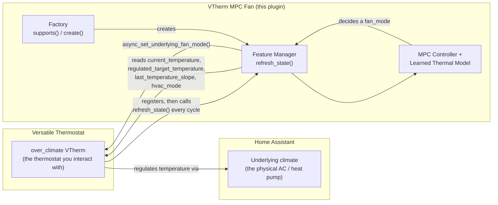
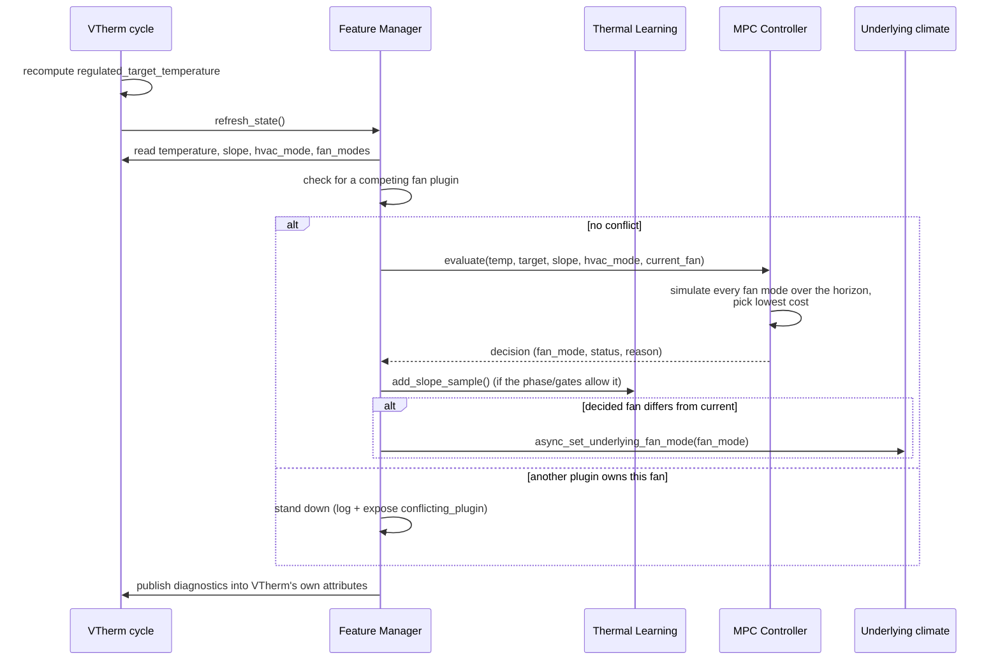

# VTherm MPC Fan

[](https://github.com/hacs/integration)

A Model Predictive Control (MPC) fan-speed controller for [Versatile Thermostat](https://github.com/jmcollin78/versatile_thermostat), delivered as a VTherm **Feature Manager plugin** rather than a standalone integration. It attaches to an `over_climate` VTherm, learns the thermal response of each fan speed on the underlying climate device, and drives that fan to minimize a predictive comfort/energy cost — instead of the fixed threshold rules VTherm's built-in auto-fan uses.

---

## Table of Contents

- [VTherm MPC Fan](#vtherm-mpc-fan)
  - [Table of Contents](#table-of-contents)
  - [How this fits into VTherm](#how-this-fits-into-vtherm)
  - [Installation](#installation)
    - [HACS (Recommended)](#hacs-recommended)
    - [Manual Installation](#manual-installation)
  - [Requirements](#requirements)
  - [Quick Setup](#quick-setup)
  - [Configuration Parameters](#configuration-parameters)
  - [One control cycle](#one-control-cycle)
  - [MPC Controller](#mpc-controller)
    - [Cost Function](#cost-function)
    - [Hysteresis and Guards](#hysteresis-and-guards)
    - [Phase Detection](#phase-detection)
    - [Disturbance Handling](#disturbance-handling)
    - [Defrost Detection](#defrost-detection)
    - [HVAC Idle Detection](#hvac-idle-detection)
    - [Window-Open Detection](#window-open-detection)
    - [Fan Speed Order](#fan-speed-order)
  - [Learning System](#learning-system)
    - [Per-Mode Fan Profiles](#per-mode-fan-profiles)
    - [Dead Time Calibration](#dead-time-calibration)
    - [Duplicate-Reading Filtering](#duplicate-reading-filtering)
    - [Defrost / Idle / Window Learning Exclusion](#defrost--idle--window-learning-exclusion)
  - [Sensors \& Entities](#sensors--entities)
    - [MPC Sensors](#mpc-sensors)
    - [Learning Sensors](#learning-sensors)
    - [Learning Profile Sensors and Numbers](#learning-profile-sensors-and-numbers)
  - [Services](#services)
    - [`vtherm_mpc_fan.apply_learned_settings`](#vtherm_mpc_fanapply_learned_settings)
    - [`vtherm_mpc_fan.reset_learning`](#vtherm_mpc_fanreset_learning)
    - [`vtherm_mpc_fan.set_effective_slope`](#vtherm_mpc_fanset_effective_slope)
    - [`vtherm_mpc_fan.force_fan`](#vtherm_mpc_fanforce_fan)
  - [Coexisting with other fan plugins](#coexisting-with-other-fan-plugins)
  - [Troubleshooting](#troubleshooting)
  - [License](#license)

---

## How this fits into VTherm

VTherm exposes an extension point — the [Feature Manager API](https://github.com/jmcollin78/versatile_thermostat) (`vtherm_api`) — that lets an external plugin attach to one specific `over_climate` thermostat and be called once per control cycle. This project is one such plugin: it registers a factory that VTherm asks *"do you apply to this thermostat?"*, and once accepted, VTherm hands it a live runtime view (current temperature, regulated setpoint, learned slope, HVAC mode, the underlying's fan modes, a way to set them) at the end of every cycle.



Two consequences follow directly from this design:

- **No separate device to configure.** You never point this plugin at a climate entity directly — you point it at the *VTherm*, and it reads/drives the underlying through VTherm's own runtime.
- **One cadence.** The control cycle is VTherm's `cycle_min` (5 minutes by default), not a private timer. See [One control cycle](#one-control-cycle).

---

## Installation

### HACS (Recommended)

1. Open HACS in Home Assistant
2. Go to **Integrations**
3. Click the three-dot menu → **Custom repositories**
4. Add `https://github.com/Gamso/vtherm_mpc_fan` with category **Integration**
5. Search for **VTherm MPC Fan** and install it
6. Restart Home Assistant

Alternatively, click the button below to open this repository directly in HACS:

[](https://my.home-assistant.io/redirect/hacs_repository/?owner=Gamso&repository=vtherm_mpc_fan&category=integration)

### Manual Installation

1. Copy the `custom_components/vtherm_mpc_fan` directory to your Home Assistant `custom_components` folder
2. Restart Home Assistant
3. Add the integration via the UI (Settings → Devices & Services → Add Integration)

---

## Requirements

- **Versatile Thermostat ≥ 10.2.0**, which provides `vtherm_api` (the plugin API this project registers with)
- An **`over_climate` VTherm already configured** in VTherm, on top of a climate entity that exposes **two or more manual fan speeds** (e.g. `low`, `medium`, `high`)
- VTherm's own auto-fan left **off** on that VTherm — see [Coexisting with other fan plugins](#coexisting-with-other-fan-plugins)

---

## Quick Setup

1. Configure the VTherm first (Settings → Devices & Services → Add Integration → Versatile Thermostat → `over_climate`, pointed at your fan-capable climate entity)
2. **Settings → Devices & Services → Add Integration → VTherm MPC Fan**
3. Select the VTherm you just created
4. Configure parameters (or use the defaults) — save, and the controller starts on the next VTherm cycle
5. Optionally, open **Configure** again once the fan modes are known to set the [fan speed order](#fan-speed-order)

---

## Configuration Parameters

All parameters can be changed at any time via **Settings → Devices & Services → VTherm MPC Fan → Configure**.

| Parameter             | Default  | Range           | Description                                                                                                                                                             |
| ---------------------- | -------- | ---------------- | ------------------------------------------------------------------------------------------------------------------------------------------------------------------------ |
| **Deadband**           | `0.2°C`  | `0.0` – `5.0°C` | Comfort zone around target — no action taken within this range. Increase to reduce fan changes.                                                                         |
| **Min Interval**       | `10 min` | `1` – `60 min`  | Minimum time between non-emergency fan changes. Prevents rapid oscillations.                                                                                             |
| **Data Collection**    | `true`   | —                | Records one CSV row per control cycle in the HA config folder (`vtherm_mpc_fan_data_XXXXXXXX.csv`, max 10 MB, auto-rotated). Useful for offline analysis.               |
| **Defrost Entity**     | *(none)* | —                | Optional entity (`binary_sensor`, `sensor`, or `input_boolean`) that reports when the heat pump is in a defrost cycle. VTherm does not report this itself. See [Defrost Detection](#defrost-detection). |
| **Fan Speed Order**    | detected | —                | One dropdown per fan speed rank, only shown once the underlying's fan modes are known (options-flow only). See [Fan Speed Order](#fan-speed-order).                     |

There is no "operating entity" or "outdoor temperature" option to set: both come from the VTherm runtime automatically (`is_device_active`, `current_outdoor_temperature`) — see [HVAC Idle Detection](#hvac-idle-detection).

---

## One control cycle



The MPC's internal prediction step (2 minutes) is independent of how often this cycle actually runs — VTherm's `cycle_min` can be 2, 5, or 15 minutes without changing the granularity of the simulated trajectory. Measurements on a 15-day production trace showed VTherm typically doesn't recompute its temperature slope faster than every few minutes anyway (it only recomputes on a new sensor reading), so a duplicate reading is filtered before it reaches the learning model — see [Duplicate-Reading Filtering](#duplicate-reading-filtering).

---

## MPC Controller

The MPC (Model Predictive Control) engine is the sole decision-maker for fan speed. Each cycle, it evaluates every available fan mode by simulating temperature evolution over an adaptive horizon and selecting the mode with the lowest cost.

To eliminate "dead-time blindness" during startup or large setpoint changes when the physical system has lag, the simulation horizon resolves adaptively to:

```
horizon = max(30, dead_time + 30) minutes
```

This ensures that every candidate fan speed is simulated for a full 30-minute window of active response after its transition delay.

See [docs/mpc_mode.md](docs/mpc_mode.md) for the full technical design.

### Cost Function

Each candidate fan mode is scored with:

| Component                   | Purpose                                                                      |
| --------------------------- | ----------------------------------------------------------------------------- |
| **Comfort error × urgency** | Penalizes being outside the deadband, with dynamic step-by-step urgency       |
| **Overshoot²**               | Strongly penalizes going past the target temperature                          |
| **Floor violation**         | Penalizes predicted temperature dropping below setpoint (linear + quadratic) |
| **Mode-change cost**        | Penalizes unnecessary fan jumps (proportional to step distance)              |
| **Mode-rank cost**          | Slight preference for lower fan speeds using a physical non-linear power curve |
| **Min-interval penalty**    | Blocks changes before the minimum interval has elapsed                        |

### Hysteresis and Guards

- **Hysteresis**: a recommendation that changes the fan must beat the current mode by a minimum cost margin. The margin is larger when near the target (0.30) and smaller when far away (0.10).
- **Step-down hold**: blocks a jump of more than one rank down to a fan mode whose own learned profile cannot sustain progress at the current comfort error — this is what stops the controller diving straight to a speed with no track record of actually holding the room.
- **Min interval**: non-emergency changes respect the configured minimum interval between fan changes.
- **Learning hold**: while the *current* speed has no measured profile (seeded values do not count), the dwell is raised to the learning gate (1.5× dead time) plus 10 minutes so the speed can actually be sampled before it is left. A speed that is never measured is never credible on cost and never chosen again, which is how intermediate speeds stayed unknown. The hold yields to comfort: it is released by the escalation guard, by an overshoot that keeps worsening, and it never applies more than 1 °C from target.
- **Climb guard**: rising more than one rank may not skip over an intermediate speed that has no measured profile and looks viable — that rung is tried first, because a speed can only be measured under load and load is exactly what a rising error means. Recoveries stay direct: past 1 °C of error (a setpoint step) or when the escalation guard fires, the jump goes straight to the strongest speed.

### Phase Detection

After each fan speed change, the controller classifies elapsed time into three phases:

| Phase           | Condition                              | Meaning                            |
| --------------- | --------------------------------------- | ------------------------------------ |
| **DEAD_TIME**   | `elapsed < dead_time`                   | Sensor hasn't reacted yet            |
| **TRANSIENT**   | `dead_time ≤ elapsed < dead_time × 1.5` | Sensor starting to respond          |
| **ESTABLISHED** | `elapsed ≥ dead_time × 1.5`             | Slope reflects the current fan regime |

The default dead time is 10 minutes, replaced by the learned median response time as soon as response events exist. The controller and the learner share this one clock: a slope sample is never taken while the MPC still considers the room in its dead time or transient.

An escalation guard sits on top of this lock: if the comfort error keeps worsening since the last fan change (by more than 0.15°C), an *escalation only* (never a step-down) is allowed to bypass the phase lock, even mid dead-time — this is what protects against getting stuck above setpoint with no way out if an earlier decision turns out to be too weak.

### Disturbance Handling

The MPC tracks a **disturbance bias** — an EMA estimate of unmodeled thermal effects (solar gains, occupancy). This correction is added to learned slopes during simulation. The bias only updates during the ESTABLISHED phase with a known profile, and decays during disturbed periods.

When a disturbance is detected (window open, defrost, or HVAC idle), the MPC pauses and returns `Disturbed` status — the current fan mode is held.

### Defrost Detection

When a heat pump defrosts its outdoor coil, the heat output drops sharply. Without defrost awareness, the controller would misinterpret the falling slope.

**External entity (required to enable this)**: configure a `binary_sensor`, `sensor`, or `input_boolean` that reports defrost state — VTherm does not expose this itself. When the entity is `on`/`true`/`1`, defrost protection activates with a 20-minute cooldown.

**During defrost protection**: the MPC pauses (`Disturbed`), and learning samples are excluded.

### HVAC Idle Detection

When the heat pump compressor is off (setpoint reached, system coasting), the HVAC is not actively heating or cooling — changing fan speed at that moment would be a wasted, meaningless command.

This is read straight from VTherm's own runtime (`is_device_active`) — **no configuration needed**, and it cannot be disabled.

**During HVAC idle**: the MPC pauses (`Disturbed`), and learning samples are excluded.

### Window-Open Detection

Also read straight from VTherm: when VTherm itself has stopped the underlying because a window is open (`hvac_off_reason == "hvac_off_window_detection"`), the MPC pauses (`Disturbed`) and learning is excluded — no separate configuration.

### Fan Speed Order

The controller treats a fan mode's position in its list as its strength: it drives the energy-cost term, the step-down safety guard, and the fallback estimate used for a speed that has not been learned yet. By default this order is whatever the underlying climate reports, which is usually correct.

If a speed is in the wrong position, the options flow (available once the underlying's fan modes are known) shows one dropdown per rank — "rank 1" is the weakest — defaulting to the order currently in effect. Change the dropdown at the rank that's wrong; the field cannot be left half-set; picking the same speed at two ranks is rejected.

---

## Learning System

The plugin includes an **automatic learning system** that collects data during normal operation and computes optimal parameters after enough samples accumulate (≥120 slope samples — sized to what the 7-day window can hold on a 0.2 °C room sensor).

**Data collected, once per control cycle**:
- Temperature slope and active fan mode
- Time from a fan speed change to the next significant slope change (thermal response time)
- HVAC mode (heat/cool), for per-mode profiling

**Parameters computed from data**:

| Parameter  | Formula                             |
| ---------- | ------------------------------------ |
| `deadband` | `0.15 + (volatility_factor × 0.2)` |

Where `volatility_factor = min(slope_stdev / slope_mean, 3.0)`.

> **Note**: the `effective_timeout` diagnostic (`max(min_interval, dead_time × 1.5)` once learning is ready) is exposed as a sensor for insight into the learned thermal lag, but it does not gate control decisions — the minimum interval between fan changes does.

Once learning is ready, computed parameters are reported via the `learning_status` sensor. Use the `apply_learned_settings` service to apply them, or `reset_learning` to start over.

### Per-Mode Fan Profiles

The learning system tracks the **effective slope per fan mode and HVAC mode** (e.g. "medium in heat" vs "high in cool"). This provides visibility into which fan speeds are actually effective in each mode.

Profiles require at least 10 samples per mode to be considered reliable, and at least 10 **measured** samples (as opposed to the synthetic ones written when you set a value by hand) before the MPC treats the speed as known rather than guessed — see the `real_samples` and `value_source` attributes below. Each profile keeps its 40 newest samples however old they are, so a speed measured a few times a week accumulates across weeks instead of losing to the 7-day window what it gathered the week before.

Samples are filtered out when:
- A window is open, or the compressor is idle, or defrost is active (see the detection sections above)
- A large setpoint drop occurred (night mode) — including a **30-minute cooldown** after the drop
- The fan mode hasn't been active long enough (**1.5× dead time**, the `ESTABLISHED` phase) for the room's response to fully reflect the current mode
- The phase is not yet `ESTABLISHED`
- The reading duplicates the last one accepted for that fan mode — see [Duplicate-Reading Filtering](#duplicate-reading-filtering)

A near-zero slope is **not** filtered out: a speed that holds the room at the setpoint produces exactly that, and it is the measurement of the profile's intercept. (An earlier 0.15 °C/h stagnation cut censored the bottom of the distribution, which both over-estimated the weak speeds and starved the intermediate ones of the few samples they get.)

The effective slope is computed as the **median** (not mean) of collected samples, for robustness against occasional outlier readings caused by thermal inertia from a previous, different fan speed. While a hand-set profile has fewer than 10 measured samples, the two medians are weighted by their counts, so every measurement visibly pulls the value instead of hiding behind the seeded one.

When two fan speeds' learned slopes are out of order (e.g. a rarely-used speed's small sample happens to read stronger than a well-sampled one above it), the better-sampled profile is trusted: the rejected estimate is not clamped onto its neighbour (which would make the two speeds thermally indistinguishable to the cost function) but re-synthesized one ladder step away from it, calibrated on the spacing of the profiles that *are* well sampled.

### Dead Time Calibration

The system measures the **thermal response time** — the delay between a fan speed change and the first observable slope change at the sensor. This median value replaces the default 10-minute dead time, letting the controller be patient during the actual thermal lag and reactive once the effect materializes.

Response events are only recorded when the delay is between 2 and 60 minutes (filtering sensor noise and system-off periods), and **once per fan change**: the first significant slope move after a change is the response, later ones inside the window are not counted again (they used to be, which drifted the median toward the middle of the window).

A fan change made outside the plugin — remote control, another automation — counts as a change too: the dead time, the response event and the learning gate all restart from it. To try a speed by hand and have it learned, prefer the `force_fan` service, which also holds it for the duration you choose.

### Duplicate-Reading Filtering

VTherm recomputes its temperature slope only when the room sensor reports a new value, so consecutive control cycles frequently observe the exact same number — especially at a short `cycle_min`. Feeding the same reading to the learning model repeatedly would record one measurement as several: since `MIN_MODE_PROFILE_SAMPLES` counts rows, a rarely-used speed could clear the reliability gate on a handful of genuine observations padded out by duplicates. A reading whose slope has not moved since the last one accepted for that fan mode is therefore dropped before it reaches the model.

### Defrost / Idle / Window Learning Exclusion

Slope samples and response-time events collected while defrost is active, the compressor is idle, or a window is open are never added to the learned profiles — see the corresponding detection sections above for why each one would otherwise bias the effective-slope and dead-time estimates.

---

## Sensors & Entities

Entity IDs are scoped by the VTherm you attached this plugin to (not the underlying climate). For example, a controller attached to `climate.living_room` (the VTherm entity) exposes `sensor.vtherm_mpc_fan_living_room_mpc_status`.

### MPC Sensors

| Entity                                                                | Unit  | Description                                                        |
| ----------------------------------------------------------------------- | ----- | --------------------------------------------------------------------- |
| `sensor.vtherm_mpc_fan_living_room_mpc_status`                          | —     | MPC state (`Not ready`, `Ready`, `Disturbed`, `Idle`, `Forced`, etc.) |
| `sensor.vtherm_mpc_fan_living_room_mpc_reason`                          | —     | Explanation of the current MPC recommendation                        |
| `sensor.vtherm_mpc_fan_living_room_mpc_fan_mode`                        | —     | Fan mode chosen by the MPC                                            |
| `sensor.vtherm_mpc_fan_living_room_mpc_would_change_now`                | —     | Whether the MPC would actively change the fan right now              |
| `sensor.vtherm_mpc_fan_living_room_mpc_cost`                            | —     | Lowest simulation cost returned by the MPC optimizer                  |
| `sensor.vtherm_mpc_fan_living_room_mpc_confidence`                      | %     | Confidence derived from learned profile coverage                      |
| `sensor.vtherm_mpc_fan_living_room_mpc_predicted_temperature_10_min`    | °C    | Predicted temperature after 10 minutes with the recommended mode      |
| `sensor.vtherm_mpc_fan_living_room_mpc_predicted_temperature_30_min`    | °C    | Predicted temperature after 30 minutes with the recommended mode      |
| `sensor.vtherm_mpc_fan_living_room_mpc_dead_time`                       | min   | Dead time currently used by the MPC simulator                         |
| `sensor.vtherm_mpc_fan_living_room_mpc_known_profiles`                  | count | Number of reliable learned fan-mode profiles                          |
| `sensor.vtherm_mpc_fan_living_room_mpc_disturbance_bias`                | °C/h  | Learned disturbance correction currently applied by the MPC model     |

The VTherm entity itself also gains a `mpc_fan` attribute section with the same status/reason/fan-mode fields, the fan speed order in use, and (when applicable) the domain of a conflicting fan plugin — see [Coexisting with other fan plugins](#coexisting-with-other-fan-plugins).

### Learning Sensors

| Entity                                                          | Unit  | Description                                          |
| -------------------------------------------------------------------- | ----- | ------------------------------------------------------- |
| `sensor.vtherm_mpc_fan_living_room_learning_progress`                | %     | Learning completion (100% = ≥120 samples)              |
| `sensor.vtherm_mpc_fan_living_room_learning_status`                  | —     | `"Learning (45%)"` or `"Ready"`                        |
| `sensor.vtherm_mpc_fan_living_room_learning_samples`                 | count | Number of slope samples collected                      |
| `sensor.vtherm_mpc_fan_living_room_learning_response_events`         | count | Number of thermal response time measurements           |
| `sensor.vtherm_mpc_fan_living_room_learned_dead_time`                | min   | Median learned thermal response delay (`dead_time`)    |
| `sensor.vtherm_mpc_fan_living_room_effective_timeout`                | min   | Advisory adaptive timeout (diagnostic only)             |
| `sensor.vtherm_mpc_fan_living_room_learned_deadband`                 | °C    | Learned optimal deadband                                |

### Learning Profile Sensors and Numbers

Once fan modes are detected, the plugin creates per-HVAC-mode profile summary sensors, and one **editable** effective-slope `number` per fan mode:

| Entity (example with `low`/`medium`/`high` fan modes)             | Unit | Description                                        |
| ------------------------------------------------------------------ | ---- | ---------------------------------------------------- |
| `sensor.vtherm_mpc_fan_living_room_mpc_heat_profiles`               | —    | JSON summary of learned heat profiles per fan mode  |
| `sensor.vtherm_mpc_fan_living_room_mpc_cool_profiles`               | —    | JSON summary of learned cool profiles per fan mode  |
| `number.vtherm_mpc_fan_living_room_heat_low_effective_slope`        | °C/h | Effective slope for `low` in heat mode              |
| `number.vtherm_mpc_fan_living_room_heat_medium_effective_slope`     | °C/h | Effective slope for `medium` in heat mode           |
| `number.vtherm_mpc_fan_living_room_heat_high_effective_slope`       | °C/h | Effective slope for `high` in heat mode             |
| `number.vtherm_mpc_fan_living_room_cool_low_effective_slope`        | °C/h | Effective slope for `low` in cool mode              |
| … (one per fan mode × HVAC mode combination)                       | …    | …                                                    |

These entities appear once the underlying's fan modes become known. Each shows a real learned value once the profile has at least 10 samples; below that, there is no fixed default — the field instead shows the live rank-scaled estimate the MPC is substituting for that speed right now (what it actually bases decisions on), so it is never blank. The `value_source` attribute says which one you're looking at: `learned` (10+ measured samples), `seeded` (a value you set, no measurement yet), `seeded_blended` (a value you set, already pulled by a few measurements) or `live_fallback_estimate`. `ready` mirrors the 10-sample threshold and `real_samples` counts the measured ones.

Click the value to edit it directly — this replaces the profile's samples with synthetic ones producing exactly the value you enter (the same effect as the `set_effective_slope` service, which remains available for automations/scripts). Real samples collected afterwards blend in and gradually refine the value; they don't reset it.

---

## Services

### `vtherm_mpc_fan.apply_learned_settings`

Report the parameters computed by the learning system to the log. Useful to inspect what would be applied, or to re-check after a manual change.

`target_vtherm` is required only when several VTherm MPC Fan controllers are running.

**Requirement**: `sensor.vtherm_mpc_fan_living_room_learning_status` must be `"Ready"`.

### `vtherm_mpc_fan.reset_learning`

Clear all learning data and start fresh. Use after HVAC maintenance or a significant system change.

`target_vtherm` is required only when several VTherm MPC Fan controllers are running.

### `vtherm_mpc_fan.set_effective_slope`

Manually set the effective slope for a specific fan mode / HVAC mode profile without resetting all learning data.

**Parameters**:

| Parameter         | Required | Example               | Description                                                  |
| ----------------- | -------- | ---------------------- | --------------------------------------------------------------- |
| `target_vtherm`   | No*      | `climate.living_room` | Required when several VTherm MPC Fan controllers are running   |
| `hvac_mode`       | Yes      | `heat`                 | The HVAC mode (`heat` or `cool`)                                |
| `fan_mode`        | Yes      | `silent`               | The fan mode name                                                |
| `effective_slope` | Yes      | `0.15`                 | Target effective slope in °C/h (positive = towards target)     |

`target_vtherm` is the **VTherm's** entity_id (the thermostat you attached this plugin to), not the underlying climate.

**Example** (Developer Tools → Services):
```yaml
service: vtherm_mpc_fan.set_effective_slope
data:
  target_vtherm: climate.living_room
  hvac_mode: heat
  fan_mode: silent
  effective_slope: 0.15
```

### `vtherm_mpc_fan.force_fan`

Force a specific fan mode for a fixed duration, overriding the MPC. The override applies immediately and expires automatically after the duration, handing control back to the MPC. Set `duration_minutes` to `0` to cancel an active override early.

**Parameters**:

| Parameter          | Required | Example               | Description                                                |
| ------------------- | -------- | ---------------------- | -------------------------------------------------------------- |
| `target_vtherm`     | No*      | `climate.living_room` | Required when several VTherm MPC Fan controllers are running |
| `fan_mode`          | Yes      | `high`                 | The fan mode to force                                          |
| `duration_minutes`  | Yes      | `30`                   | How long to hold the forced mode; `0` cancels an active override |

**Example** (Developer Tools → Services):
```yaml
service: vtherm_mpc_fan.force_fan
data:
  target_vtherm: climate.living_room
  fan_mode: high
  duration_minutes: 30
```

While a force is active, `mpc_status` reports `Forced` and `mpc_reason` shows the remaining time.

---

## Coexisting with other fan plugins

Only one controller can own a fan mode. Two plugins driving the same underlying (this one and, for instance, [`vtherm_auto_fan_extended`](https://github.com/jmcollin78/vtherm_auto_fan_extended), or VTherm's own built-in auto-fan) would not merely duplicate effort: each would read the other's command as an external change, the speed would flap between two opinions, and both would learn from a trajectory neither produced.

- The config flow **refuses** to attach this plugin to a VTherm another fan plugin already targets.
- If a conflict appears later anyway (the other plugin installed afterwards), this plugin **stands down**: it keeps evaluating and learning, but withholds the fan command. The current conflict is visible as `conflicting_plugin` in the VTherm's `mpc_fan` attributes, and as an error-level log line.
- Removing the other plugin lets control resume automatically, on the next cycle.

Make sure VTherm's own **auto-fan** option is set to `none` on the VTherm you attach this plugin to.

---

## Troubleshooting

| Symptom                        | What to check / do                                                                                                                         |
| -------------------------------- | ---------------------------------------------------------------------------------------------------------------------------------------------- |
| **Fan not changing**            | Check `sensor.vtherm_mpc_fan_living_room_mpc_status` and `mpc_reason`. The MPC may be paused (disturbed) or the min interval hasn't elapsed. |
| **MPC status: Not ready**       | Learning hasn't collected enough profiles. Check `sensor.vtherm_mpc_fan_living_room_mpc_known_profiles` and `learning_progress`.             |
| **MPC status: Disturbed**       | Defrost, HVAC idle, or a window open is detected. Normal — the MPC holds the current fan until the disturbance clears.                        |
| **Fan not changing at all, no error** | Another plugin may already be driving this fan — check the VTherm's `mpc_fan.conflicting_plugin` attribute. See [Coexisting with other fan plugins](#coexisting-with-other-fan-plugins). |
| **Too many fan changes**        | Increase `deadband` or `min_interval`. Enable learning to auto-optimize.                                                                        |
| **Temperature overshoots**      | Decrease `deadband`. Verify Versatile Thermostat is providing an accurate slope.                                                                |
| **Learning not progressing**    | Verify the HVAC is running and no window is open. Check whether `cycle_min` on the VTherm is unusually long.                                   |
| **A weak fan speed's learned slope looks wrong** | Check its sample count before trusting the value — under 10 samples it isn't shown as a reliable profile. See [Per-Mode Fan Profiles](#per-mode-fan-profiles). |

---

## License

This project is licensed under the MIT License.
